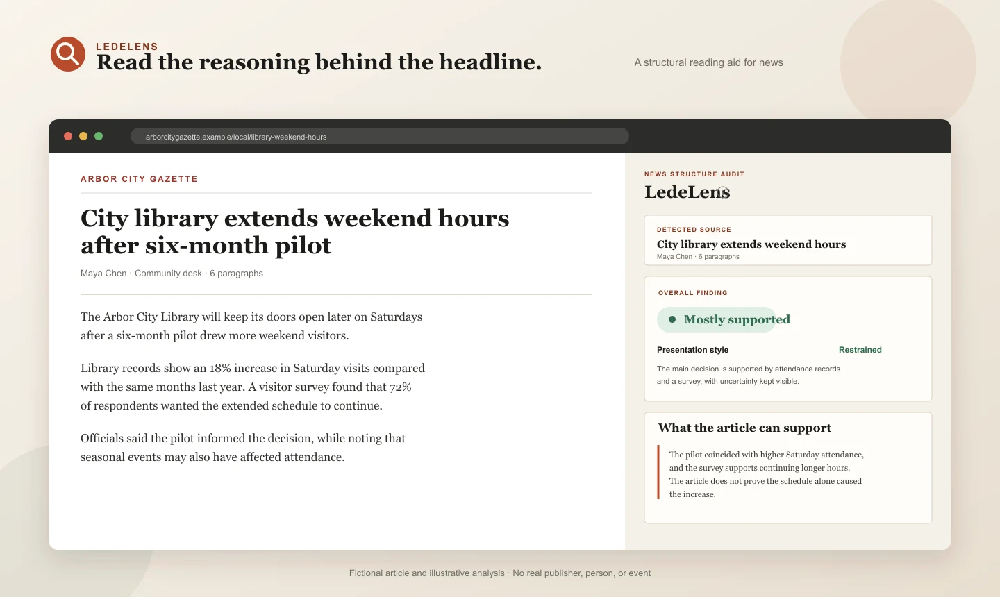
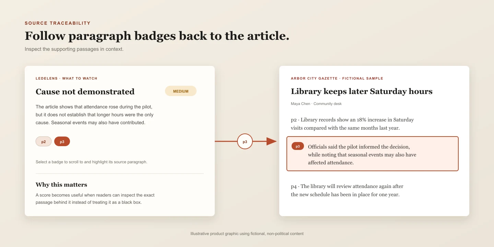
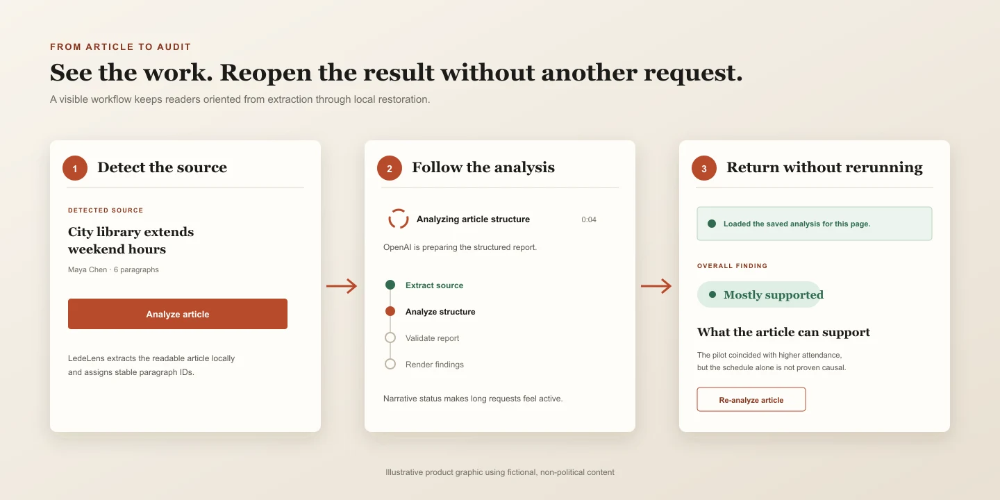

# LedeLens

**Read the reasoning behind the article.**

LedeLens is an open-source Chrome extension that shows whether an article's conclusions follow from the evidence it presents—without fact-checking the article or judging its viewpoint.

[](LICENSE)


> **Interactive demo: [ledelens.app](https://ledelens.app)** — explore a saved analysis of a fictional article without an API key.
>
> **Chrome extension:** Under review in the Chrome Web Store. Until it is approved, follow the [Quick Start](quick-start.md) to install it locally.
>
> **Easy download:** Get the latest Chrome-ready ZIP from [GitHub Releases](https://github.com/biaoxie/lede-lens/releases/latest). Extract it and follow the included `INSTALL.md`; no Node.js or build step is required.



> **Scope:** LedeLens examines internal support, sourcing, cause and effect, missing context, and the separation of reporting from interpretation. Its findings are reading aids—not verdicts on truth, credibility, fairness, or intent.

Its guiding question is intentionally narrow:

> Assuming the reported material is accurate, how well does the article support its conclusions?

## Why LedeLens?

An article can report accurate facts and still reach beyond what those facts support. LedeLens helps readers notice that gap without asking them to agree with a particular political viewpoint.

## What you will learn

For each analysis, LedeLens gives readers:

- **A clear overall finding** — from **Well supported** to **Very little support**
- **Five practical questions** — covering evidence, sourcing, causality, context, and the separation of fact from interpretation
- **What to watch** — up to three material weaknesses, such as unsupported causation, missing baselines, one-sided sourcing, or certainty inflation
- **A bounded conclusion** — the strongest conclusion the article can support on its own terms
- **Source-linked explanations** — paragraph badges that return to and highlight the relevant passage

Analyze the full article or select a specific passage. Reports appear in Chrome's side panel, alongside the page you are reading.



## A visible, reusable workflow

LedeLens shows what it is doing while a report is generated. After a successful analysis, it can restore the result for the same unchanged article from local extension storage—without another OpenAI request.



## What LedeLens does—and does not do

LedeLens is a **structural reading aid**. It evaluates whether an article's conclusions stay within its stated evidence and whether its reasoning is presented clearly.

It does not:

- verify events, quotations, statistics, or linked documents;
- rate the real-world credibility of a publication or source;
- decide which political viewpoint is correct;
- infer that an author intended to manipulate readers.

The result should be a prompt for closer reading, not a substitute for judgment or independent verification.

## Quick start

Requirements:

- Google Chrome 116 or newer
- Node.js 24 or newer
- An OpenAI API key

```bash
git clone https://github.com/biaoxie/lede-lens.git
cd lede-lens
npm ci
```

Then:

1. Open `chrome://extensions`.
2. Enable **Developer mode**.
3. Select **Load unpacked** and choose the repository folder.
4. Open an article-like webpage and select the LedeLens toolbar icon.
5. Enter your OpenAI API key, load the models available to that key, choose one, and confirm.
6. Select **Analyze article**.

For installation details, selected-text analysis, cached reports, and troubleshooting, see the [Quick Start](quick-start.md).

## Project status

LedeLens is under review in the Chrome Web Store and can currently be installed locally as an unpacked extension. The current provider integration supports OpenAI; the analysis contract itself remains provider-neutral. API usage may incur OpenAI charges, and extraction can be incomplete on paywalled pages, protected browser pages, or sites that render article text inside inaccessible frames.

## How it works

```text
Article or selected passage
  → Mozilla Readability extracts the article locally
  → LedeLens assigns stable paragraph IDs
  → OpenAI returns a structured analysis
  → LedeLens validates the result locally
  → The side panel renders findings linked to the article
```

Article text is treated as untrusted input and is sent separately from the analysis instructions. It cannot redefine the model's role or output contract.

The provider-neutral analysis contract lives in:

- [`skills/analyze-news-structure/assets/system-prompt.md`](skills/analyze-news-structure/assets/system-prompt.md) — canonical model instructions
- [`skills/analyze-news-structure/assets/output-schema.json`](skills/analyze-news-structure/assets/output-schema.json) — canonical output contract

Breaking changes to fields or their meaning require a new schema version; see [`MIGRATIONS.md`](MIGRATIONS.md).

## Privacy and API-key handling

LedeLens currently calls OpenAI directly from the Chrome side panel. This keeps the project simple and inspectable, but a browser extension is still a sensitive place for a provider credential.

- Your API key stays out of article pages and content scripts.
- The key is stored in `chrome.storage.session`, not synchronized storage.
- Chrome clears it when the browser session ends.
- LedeLens does not intentionally log, sync, or commit the key.
- OpenAI requests use `store: false`.
- Only article text and metadata extracted for the analysis you request are sent to OpenAI; the page URL is not sent.

Successful reports are stored in `chrome.storage.local` so reopening the same unchanged article does not require another API call. Each entry contains the report, an article URL stripped of query parameters and fragments, and a non-reversible content fingerprint. The cache is local to the browser profile, is not synchronized with Chrome Sync, and is limited to 30 reports. A changed article does not reuse its earlier cached report. Use **Clear saved analyses** in settings to delete the cache.

Read the [Privacy Policy](PRIVACY.md), use a restricted OpenAI project key, monitor its usage, and review [SECURITY.md](SECURITY.md) before using a valuable or broadly privileged key.

## Model selection and request behavior

LedeLens requests `/v1/models` with the API key you provide and lets you explicitly select a compatible GPT-5 model. It does not hard-code a reasoning effort; the selected model uses its default. Low output verbosity reduces redundant JSON prose without removing any part of the analysis contract.

Requests use the OpenAI Responses API event stream. The side panel describes observable progress while a report is generated and shows the total completion time. A collapsed **Technical details** section keeps time to first output, reasoning-token usage, request ID, model, and schema available when OpenAI provides them.

## Page access and cached reports

LedeLens uses Chrome's temporary `activeTab` permission instead of requesting permanent access to every website. Selecting the toolbar icon grants access to the current page.

If the side panel remains open while you navigate or switch tabs, LedeLens clears the previous report and asks you to select the toolbar icon again. Once access is granted, it restores a matching cached report or prepares the new page for analysis.

## Development

Install dependencies and run all checks:

```bash
npm ci
npm run verify
```

Verification includes static integration checks and enforces at least 95% line, branch, and function coverage for the unit-testable core modules in `src/lib/`.

Mozilla Readability is the only runtime dependency. It processes a cloned document locally; no separate extraction service receives the page. After changing extension files, reload LedeLens from `chrome://extensions` and refresh the article tab.

The browser-ready Readability source and its license are vendored in
`src/vendor/mozilla-readability/`; the npm dependency remains the upstream
provenance used for updates.

### Project layout

```text
manifest.json                         Chrome extension manifest
assets/icons/                        Packaged extension icons
design/brand/                        Editable Open Frame logo sources
src/background.js                    Settings, cache, and side-panel lifecycle
src/content.js                       Article extraction, source mapping, and highlighting
src/lib/openai.js                    OpenAI streaming, parsing, and result validation
src/lib/cache.js                     URL/content matching and bounded local cache
src/lib/validator.js                 JSON Schema and paragraph-reference validation
src/sidepanel/                        Side-panel interface
skills/analyze-news-structure/        Provider-neutral analysis contract
tests/                                Node test suite
scripts/check.mjs                     Static repository checks
store/                                Chrome Web Store copy, demo, and promotional assets
```

## Contributing

Issues and focused pull requests are welcome. Please read [CONTRIBUTING.md](CONTRIBUTING.md) before changing analysis behavior, provider integration, credential handling, or the output schema.

## License

LedeLens is licensed under the [Apache License 2.0](LICENSE).
